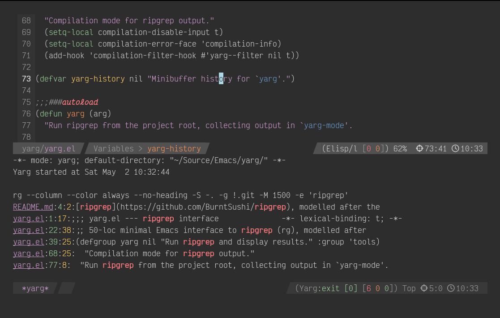

# yarg

50-loc minimal Emacs interface to
[ripgrep](https://github.com/BurntSushi/ripgrep), modelled after the
great [ack-el](https://github.com/leoliu/ack-el) and `M-x grep`.

No pompous conceptual overhead, just plain old boring Emacs
compilation-mode integration goodness.

## Usage

Bind `yarg` to a key, e.g. `(keymap-global-set "C-c s" #'yarg)`, then:

| Key             | Behaviour                                            |
|-----------------|------------------------------------------------------|
| `C-c s`         | Search symbol at point from project root immediately |
| `C-u C-c s`     | Same, but edit suggested `rg` command first      |
| `C-u C-u C-c s` | Choose a directory and edit the `rg` command         |

Results appear in a `yarg-mode` buffer (a `compilation-mode` derivative).
Standard `next-error` / `previous-error` navigation works as usual.

## Customization

Only `yarg-switches` if you want to change the `-S` for `-i` for
example.
